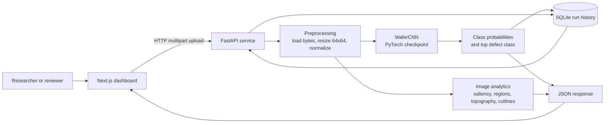

# CNNIG: Wafer Defect Classification and Analysis

CNNIG is a wafer-map defect classification and analysis system built around a
PyTorch convolutional neural network. The repository contains the trained model,
FastAPI inference service, Next.js dashboard, sample data, and legacy prototype
code used to inspect wafer defect patterns.

The project is intended to support an academic paper workflow: the source code,
model-serving path, architecture diagram, and reproducibility notes are kept in
the repository so readers can inspect and run the implementation behind the
reported results.

## Repository Contents

- `api/`: FastAPI application, model loading, preprocessing, prediction routes,
  analysis routes, persistence, and response schemas.
- `web/`: Next.js dashboard for classification, batch prediction, history, and
  visual analytics.
- `sample_data/`: Example wafer defect data for local testing.
- `best_wafercnn.pt`: Trained WaferCNN checkpoint loaded by the API.
- `Just_RCA.ipynb`: Notebook artifact for root-cause and exploratory analysis.
- `wafer_map_analyzer/`: Earlier full-stack prototype retained for reference.
- `docs/architecture.md`: System architecture diagram and data-flow notes.
- `docs/reproducibility.md`: Environment and execution notes for paper reviewers.

## Architecture

The complete architecture diagram is maintained in
[`docs/architecture.md`](docs/architecture.md).



## Quick Start

### Backend API

Install the Python dependencies:

```bash
uv sync
```

Run the FastAPI service:

```bash
uv run uvicorn api.main:app --reload
```

The API exposes health, prediction, batch prediction, analysis, history, and
analytics endpoints under `/api`.

### Frontend Dashboard

Install and run the web dashboard with Bun:

```bash
cd web
bun install
bun run dev
```

Open `http://localhost:3000` and ensure the backend is available at the API URL
configured in `web/lib/api.ts`.

## Model Interface

The serving path expects an uploaded image, `.npy`, or `.npz` wafer map. Inputs
are converted to a two-dimensional array, resized to 64x64, normalized to
`[0, 1]`, and passed to `WaferCNN`.

The current class labels are:

- `Center`
- `Donut`
- `Edge-Loc`
- `Edge-Ring`
- `Local`
- `Random`
- `Scratch`
- `Near-full`

## Paper Citation

Citation metadata is provided in [`CITATION.cff`](CITATION.cff). Update the
paper title, author list, DOI, and release version before the final paper
submission if those values differ from the repository metadata.

## Reproducibility Notes

See [`docs/reproducibility.md`](docs/reproducibility.md) for environment setup,
runtime assumptions, and verification commands.

## License

No license file has been added yet. Choose and add the appropriate research or
open-source license before relying on reuse permissions from the public
repository.
