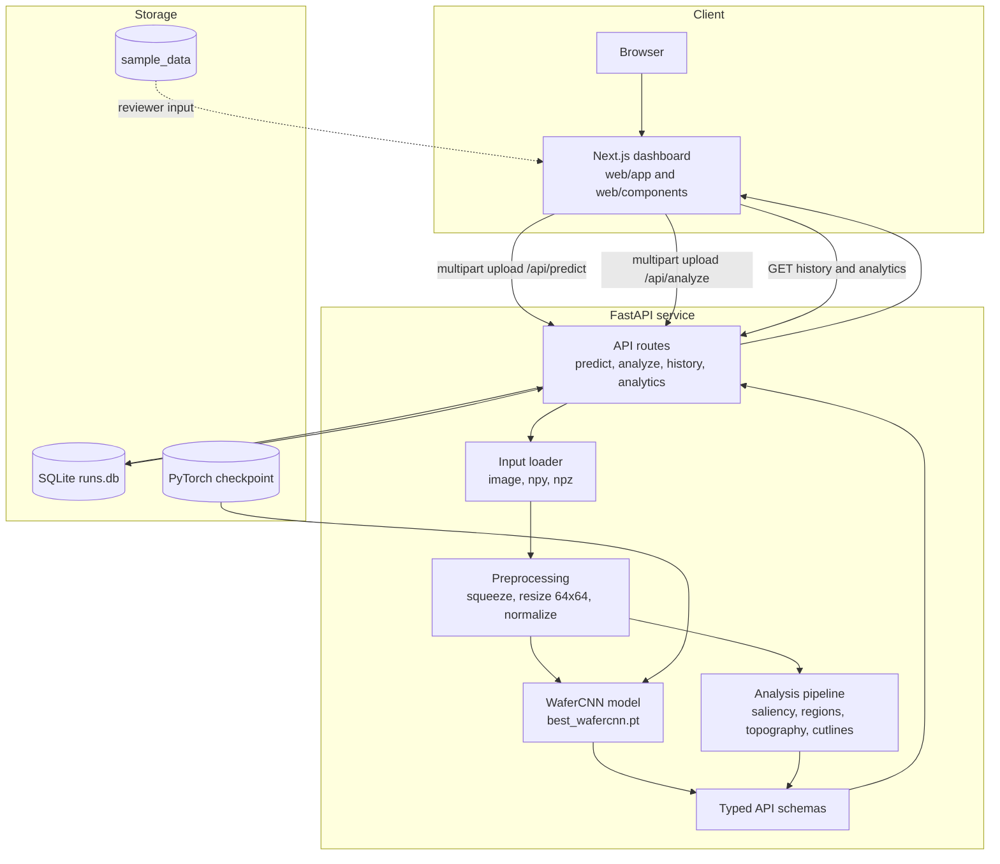

# Architecture

This document describes the repository architecture used to serve and inspect
the wafer defect classifier.

## System Diagram

## Runtime Data Flow

1. A reviewer or researcher uploads a wafer map through the Next.js dashboard.
2. The dashboard submits the file to the FastAPI service as multipart form data.
3. The API loads image, `.npy`, or `.npz` bytes and converts the input to a
   two-dimensional wafer map.
4. The preprocessing step resizes the wafer map to 64x64 and normalizes values
   to `[0, 1]`.
5. `WaferCNN` loads `best_wafercnn.pt` and returns class probabilities plus the
   top predicted defect class.
6. The analysis endpoint can also compute visualization-oriented outputs such
   as saliency, region statistics, topography data, and cutline profiles.
7. Prediction metadata is stored in SQLite so the dashboard can show history and
   aggregate analytics.

## Main Components

| Component | Path | Responsibility |
| --- | --- | --- |
| Dashboard | `web/` | Researcher-facing UI for upload, classification, history, and analytics. |
| API entrypoint | `api/main.py` | FastAPI setup, CORS, database initialization, and route registration. |
| Model | `api/model.py` | WaferCNN definition, checkpoint loading, preprocessing, and prediction. |
| Analysis | `api/analysis.py` | Derived wafer-map analytics used by the detailed analysis view. |
| Persistence | `api/db.py` | SQLite-backed run history using SQLModel. |
| Schemas | `api/schemas.py` | Typed API response contracts consumed by the dashboard. |

## Deployment Shape

The repository includes Render and Vercel-oriented configuration:

- `render.yaml` describes backend deployment settings.
- `web/vercel.json` describes the frontend deployment settings.

For local paper-review execution, run the FastAPI backend first and then run the
Next.js frontend with Bun.
